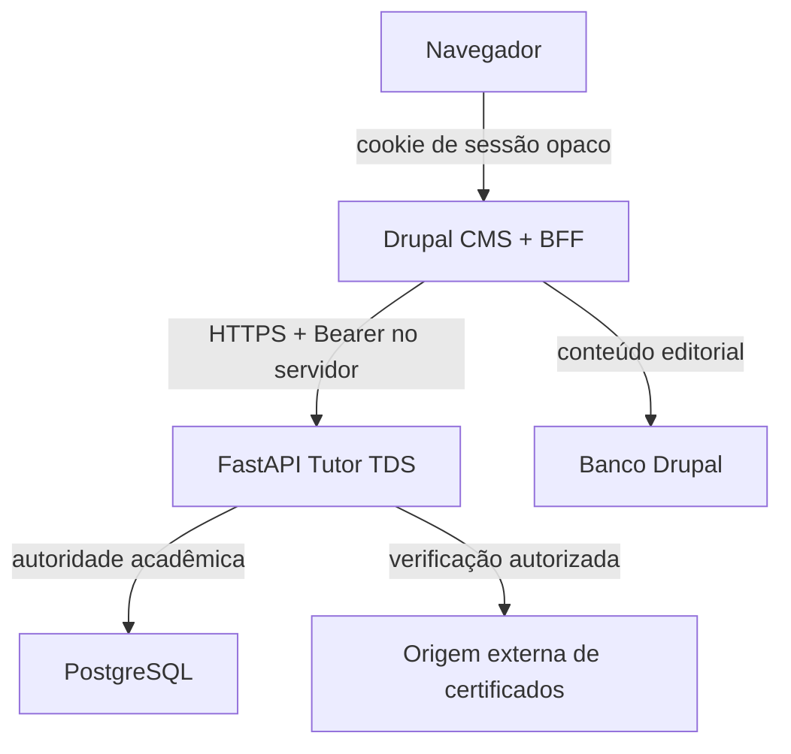

# ADR-DR-1 — Limite arquitetural Drupal ↔ Tutor TDS

Status: **proposto para implementação**, contrato documental de DR-1.

Base auditada: `staging@d2da096fe13dd18641aa8b557b3702622baa3b34`.

Escopo: portal Drupal, adaptador web e integração HTTP. Este ADR não ativa produção nem altera API, aplicativo, banco ou infraestrutura.

## Vocabulário de estado

- **OBSERVED**: comportamento comprovado no código ou teste da base auditada.
- **TARGET**: decisão obrigatória para a implementação Drupal, ainda sem evidência de código Drupal neste repositório.
- **BLOCKED**: jornada sem contrato suficiente; exige Issue própria antes de implementação.

## Decisão

**TARGET** — Drupal é CMS editorial e BFF (backend for frontend) do portal web. Ele não é autoridade acadêmica, não acessa diretamente o PostgreSQL do Tutor TDS e não reproduz regras acadêmicas. Todas as decisões sobre identidade TDS, matrícula, turma, edição, progresso, presença, elegibilidade e certificado continuam no FastAPI.

## Responsabilidades e autoridade

| Domínio | Componente autoritativo | Drupal pode | Drupal não pode | Estado |
| --- | --- | --- | --- | --- |
| Conteúdo editorial, menus e páginas institucionais | Drupal | Publicar e versionar conteúdo editorial | Declarar conclusão, presença ou certificação | TARGET |
| Catálogo público | FastAPI `/public/*` | Renderizar a projeção pública e armazenar cache pelo TTL devolvido | Expor rascunhos ou campos fora da projeção | OBSERVED + TARGET |
| Identidade e autenticação TDS | FastAPI `/auth/*` | Mediar login/refresh no servidor e manter sessão opaca | Guardar token no navegador ou usar conta editorial como identidade acadêmica | OBSERVED + TARGET |
| Matrícula, turma, edição e progresso | FastAPI | Renderizar projeções autorizadas | Copiar fatos acadêmicos para o banco Drupal como fonte de verdade | OBSERVED + TARGET |
| Operação e administração | FastAPI | Apresentar comandos permitidos por escopo e reenviar contexto atual | Inferir permissão por papel global ou contornar `409` | OBSERVED + TARGET |
| Certificados | FastAPI + origem externa configurada | Listar a carteira autenticada e encaminhar à URL pública autorizada | Emitir ou validar certificado consultando banco próprio | OBSERVED + TARGET |

Evidência: [`api/app/public_api.py`](../../api/app/public_api.py), [`api/app/auth.py`](../../api/app/auth.py), [`api/app/learning_context.py`](../../api/app/learning_context.py), [`api/app/operator_operations.py`](../../api/app/operator_operations.py) e [`api/app/certificates.py`](../../api/app/certificates.py).

## Componentes do portal

### CMS editorial

**TARGET** — Nodes, media, menus e configuração visual ficam no Drupal. Dados públicos do Tutor TDS podem ser materializados somente como cache descartável, com origem, instante de captura e TTL. A indisponibilidade da API nunca transforma o cache em autoridade.

### BFF TDS

**TARGET** — Um módulo customizado encapsula:

1. cliente HTTP com allowlist de origem, TLS obrigatório, limites de tempo e correlação;
2. sessão TDS no servidor, vinculada a um identificador opaco em cookie;
3. políticas de cache separadas para conteúdo público e autenticado;
4. tradução de erros sem ocultar `401`, `403`, `404`, `409`, `422`, `429` ou `503`;
5. proteção CSRF e validação de origem em toda mutação;
6. redaction de credenciais, CPF, telefone, identificadores acadêmicos e payloads livres em logs.

O módulo não implementa SQL contra o banco acadêmico, não importa modelos FastAPI e não replica cálculo de progresso ou elegibilidade.

### Identidades separadas

**TARGET** — Conta editorial Drupal e identidade TDS são domínios distintos. Um participante TDS não precisa de usuário Drupal. Quando uma pessoa também for editora, eventual vínculo entre as contas deve ser explícito, auditável e objeto de decisão posterior; não se usa e-mail, CPF ou telefone para associação automática.

## Fluxos e cache

### Público

**OBSERVED** — `GET /public/courses` e `GET /public/courses/{slug}` devolvem somente projeções publicadas e cabeçalho `Cache-Control: public, max-age=60, stale-while-revalidate=300`.

**TARGET** — O Drupal respeita o cabeçalho, diferencia variantes pelo recurso público e não inclui cookie, identidade ou parâmetro sensível na chave.

### Autenticado

**TARGET** — Páginas de participante, operação e administração usam `Cache-Control: private, no-store`; respostas não entram em cache compartilhado, page cache, CDN ou render cache público. O navegador recebe apenas HTML/JSON já minimizado pelo BFF, nunca tokens TDS.

### Escritas

**TARGET** — O BFF preserva chave de idempotência, versão/revisão e identificador de requisição. Erros `409` exigem nova leitura antes de reenvio; a interface não repete comandos automaticamente. `422` mostra pendência de domínio; `401` tenta no máximo um refresh sincronizado; `403` encerra a ação; `429` respeita `Retry-After`; `503` mantém o estado como indisponível, sem dado inventado.

## Segurança e observabilidade

- **TARGET** — Cookie de sessão: `Secure`, `HttpOnly`, `SameSite=Lax` por padrão, escopo mínimo de domínio/caminho e rotação após autenticação.
- **TARGET** — Access e refresh tokens ficam apenas no servidor, cifrados em repouso quando persistidos e nunca em URL, HTML, JavaScript, `localStorage`, analytics ou log.
- **TARGET** — Logs registram `request_id`, rota lógica, status, duração e classificação do erro; não registram token, cookie, CPF, telefone, nome completo, conteúdo livre ou resposta acadêmica integral.
- **TARGET** — Métricas agregadas não incluem identificador de pessoa. Eventos de analytics públicos aceitam somente slug público aprovado.
- **TARGET** — Fail closed: configuração ausente, origem não permitida ou contrato desconhecido bloqueiam a operação.

## Compatibilidade e mudanças

- **TARGET** — O BFF valida o contrato conhecido e ignora apenas campos adicionais seguros; ausência ou alteração semântica de campo obrigatório falha de forma visível.
- **TARGET** — Feature flags da API continuam autoritativas. Uma rota que responde `404` por flag desligada não é simulada no Drupal.
- **TARGET** — Novos endpoints ou ampliações de PII exigem Issue e atualização desta matriz antes do consumo.
- **TARGET** — O portal não modifica o cliente Flutter nem altera seus contratos.

## Lacunas bloqueantes

1. **BLOCKED** — Não há endpoint FastAPI de logout/revogação de refresh token observado em [`api/app/auth.py`](../../api/app/auth.py). O logout local pode destruir a sessão Drupal, mas revogação remota precisa de Issue própria.
2. **BLOCKED** — Não há rota pública FastAPI para verificar certificado. [`api/app/certificates.py`](../../api/app/certificates.py) valida uma origem externa configurada e armazena sua URL; o portal só pode encaminhar para origem previamente aprovada.
3. **BLOCKED** — Nomes de módulo, configuração de secrets, topologia de hospedagem e ativação produtiva dependem da etapa de implementação/infra e de gate humano aplicável.

## Critério de aceite deste ADR

Os consumidores Drupal futuros devem apontar cada integração para uma linha de [`API_CONTRACT_MATRIX.md`](API_CONTRACT_MATRIX.md), aplicar [`AUTH_SESSION_DECISION.md`](AUTH_SESSION_DECISION.md) e comprovar os cenários de [`E2E_ACCEPTANCE.md`](E2E_ACCEPTANCE.md). Qualquer desvio reabre decisão arquitetural; CI verde não autoriza merge nem produção.
