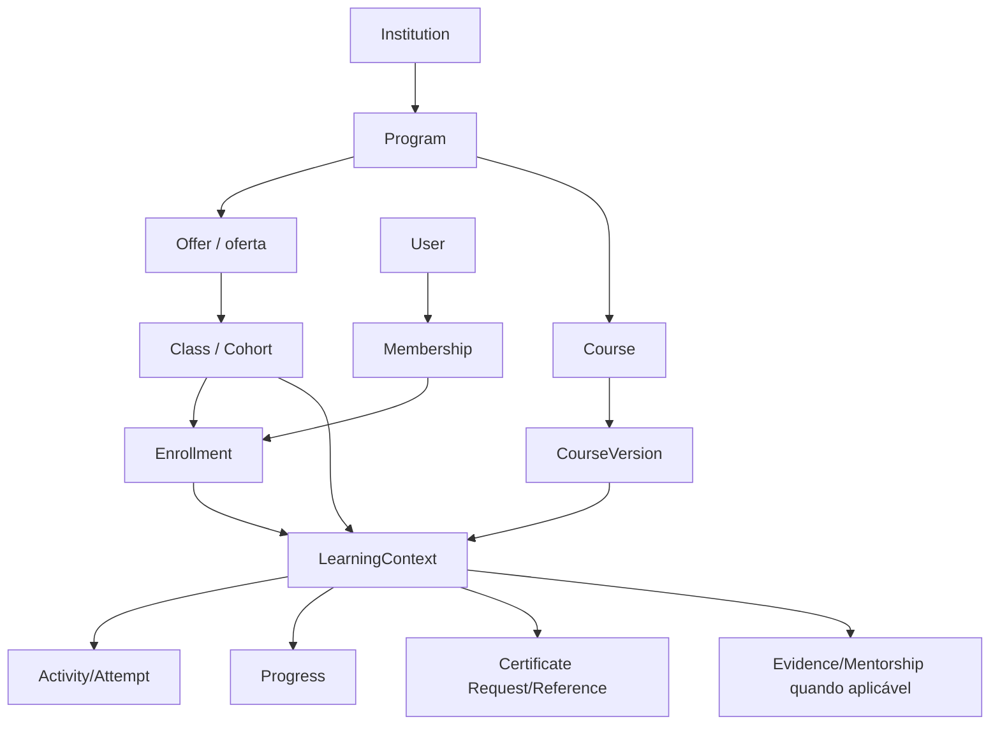
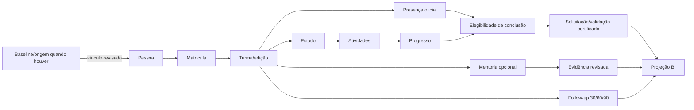
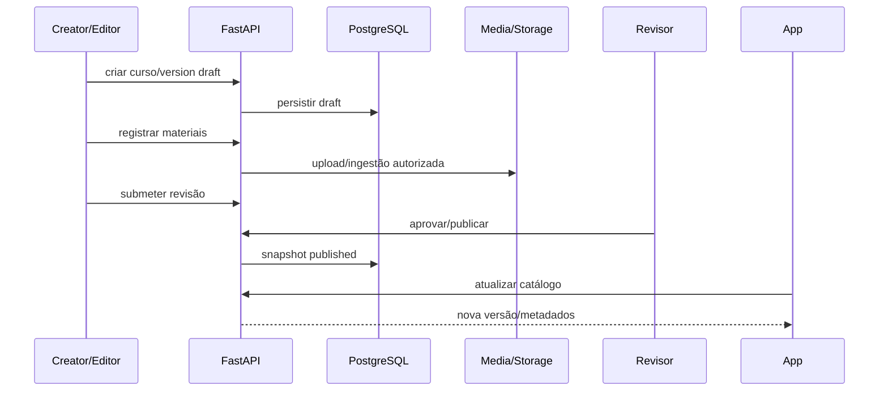
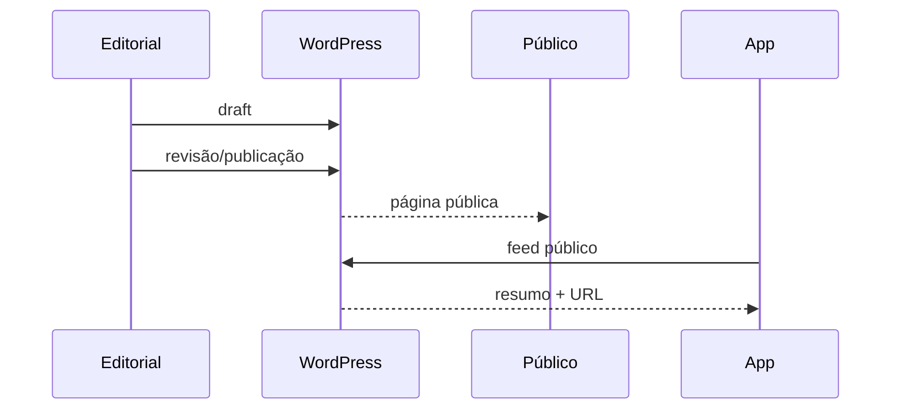
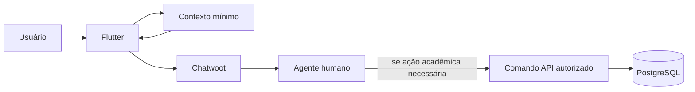
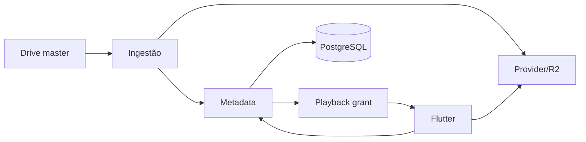
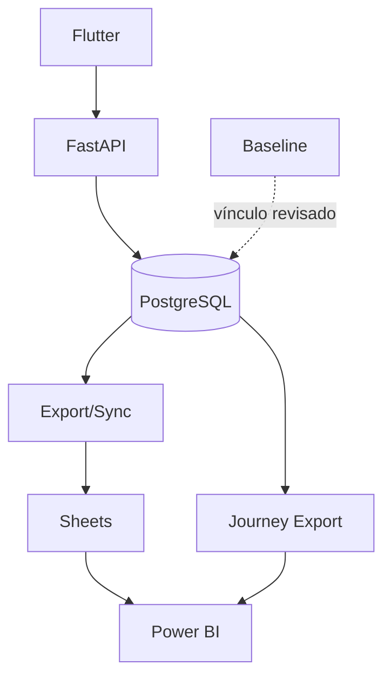
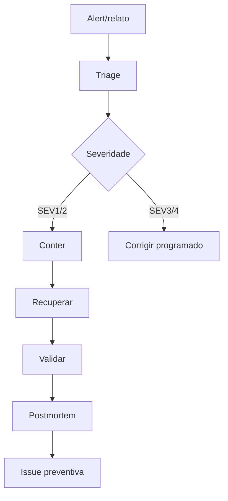
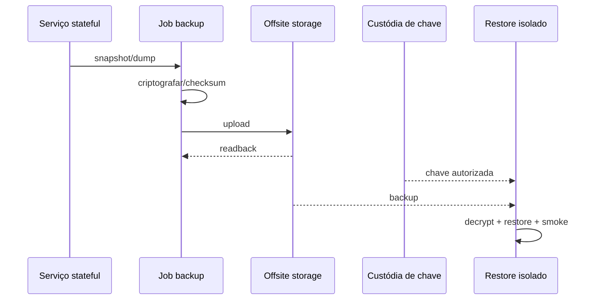

# Fluxos e hierarquias ponta a ponta

## 1. Hierarquia organizacional e pedagógica

A nomenclatura exata deve seguir as entidades reais do domínio. O desenho lógico é:



Regra: a UI pode simplificar nomes, mas autorização usa IDs/contexto completo.

## 2. Hierarquia de autoridade

```text
decisão institucional
    ↓
contrato de domínio
    ↓
API autorizada
    ↓
persistência PostgreSQL
    ↓
eventos/projeções
    ↓
Sheets/BI/portal/support context
```

Nunca inverter a seta para conceder direito com base em projeção.

## 3. Jornada do participante



Baseline não cria matrícula automaticamente.

## 4. Novo curso



Nenhum rebuild do app deve ser necessário para conteúdo editorial normal.

## 5. Nova notícia



Notícia não passa pelo PostgreSQL acadêmico.

## 6. Atendimento



Etiqueta/macro Chatwoot não substitui CMD autorizado.

## 7. Mídia



## 8. Dados/BI



Linha pontilhada = vínculo controlado, não ingestão irrestrita.

## 9. Release

```mermaid
flowchart LR
  I[Issue] --> B[Branch]
  B --> PR[Draft PR]
  PR --> CI[CI/checks]
  CI --> RV[Review]
  RV --> ST[Staging]
  ST --> AC[Acceptance]
  AC --> PF[Preflight]
  PF --> HG[Human release gate]
  HG --> PD[Production]
  PD --> SM[Smoke/monitor]
  SM --> CS[CURRENT_STATE/evidence]
```



## 10. Incidente



## 11. Backup/restore



Objeto e chave não devem depender da mesma credencial única.

## 12. Hierarquia operacional de responsabilidade

```text
Coordenação / Product Owner
├── Pedagógico
├── Dados/LGPD
├── Comunicação/Editorial
├── Suporte/Monitoria
└── Tecnologia
    ├── Desenvolvimento
    ├── Infra/Operação
    └── Release/Segurança
```

Isso é separação de responsabilidade, não organograma institucional obrigatório.

## 13. Pontos de decisão humana

- regra de frequência;
- elegibilidade/mentoria;
- publicação institucional;
- liberação produção;
- retenção/privacidade;
- acesso administrativo;
- compra de provider;
- exclusão irreversível.

Agentes podem preparar implementação e testes, mas não fabricar essas decisões.
