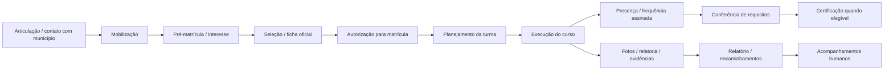
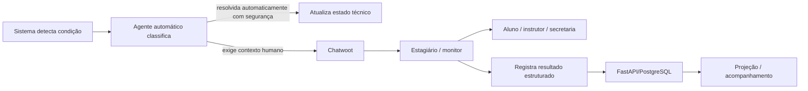

# Modelo operacional observado — Secretaria / execução TDS

Status: **OBSERVED + TARGET derivado**.

Leitura histórica da operação. As perguntas e gates iniciais abaixo devem ser
confrontados com `OPERATING_DECISIONS_2026-10-03.md`, que registra as respostas
posteriores. Não reabrir como bloqueio geral uma decisão já confirmada.

Este documento traduz para o desenvolvimento o processo operacional já usado pela equipe do TDS e preservado na pasta de trabalho compartilhada da secretaria. O objetivo não é digitalizar tudo nem substituir pessoas. É identificar o que o sistema precisa apoiar para reduzir retrabalho, localizar pendências e encaminhar casos ao humano certo.

## 1. Fontes observadas

Estrutura consultada na pasta compartilhada do projeto:

- `Docs Modelos/Docs MDS`
  - Lista de Presença Oficial - SISEC
  - Ficha de Inscrição Oficial - SISEC
  - Ficha de Inscrição para Seleção dos Alunos
- `Docs Modelos/Docs UFT`
  - Frequência01_TDS
  - Matrícula_TDS
  - Planejamento TDS - Turmas 1º Ciclo
  - documentos administrativos de bolsistas
- `Evidências - TDS/Planejamento`
- `Evidências - TDS/Mobilizações`
- `Evidências - TDS/Cursos`
- `Documentos Viagens`
  - relatório de evento
  - frequência
  - apresentação e materiais
- `Modelos Gráficos`
- cronograma de mobilização Jan/Fev/2026.

A pasta mostra processos, documentos e evidências. Ela **não é fonte transacional do app** e não deve ser transformada em banco acadêmico.

## 2. Fluxo operacional observado



Esse fluxo deve orientar o sistema. Não criar etapas artificiais só porque são fáceis de automatizar.

## 3. Mobilização

### OBSERVED

O cronograma de mobilização orienta a equipe a:

1. contatar municípios e verificar agenda;
2. enviar ofícios para prefeituras e parceiros estratégicos;
3. realizar reunião/apresentação;
4. preencher lista de presença;
5. levar/usar banner do projeto;
6. definir responsável por relatoria e fotos;
7. disponibilizar link/QR Code de pré-matrícula;
8. registrar equipe e responsabilidades;
9. seguir com matriz curricular e operacionalização dos cursos.

Também aparecem papéis práticos distintos: apresentação, matrículas/relatoria, articulação/comunicação e relatoria.

### TARGET mínimo no sistema

O Tutor TDS não precisa virar sistema de protocolo/ofício para atender esse processo.

Precisa apenas conseguir relacionar:

```text
ação de mobilização
território/local
data
parceiros
responsáveis
curso(s) de interesse
link/QR de pré-matrícula
evidências/referências documentais
encaminhamentos
status
```

A secretaria continua responsável por ofícios, articulação política/institucional e documentos formais.

## 4. Pré-matrícula, interesse e matrícula

### OBSERVED

O formulário UFT de matrícula/interesse coleta:

- nome;
- nascimento/idade;
- gênero;
- CPF;
- telefone/WhatsApp;
- endereço;
- cidade/UF;
- área/curso de interesse;
- disponibilidade de dias/horários.

A ficha oficial SISEC é mais ampla e inclui:

- curso, início, término, local e carga horária;
- nome, nascimento, CPF, RG;
- gênero;
- perfil étnico-racial;
- naturalidade;
- contato;
- endereço;
- escolaridade;
- deficiência e necessidade de atendimento especial;
- situação de trabalho e seguro-desemprego;
- CadÚnico;
- SINE;
- participação em políticas;
- grupos e perfis específicos;
- trabalhador rural/pescador/cooperativado etc.;
- assinatura;
- autorização formal de matrícula por responsável.

### Regra de domínio

```text
interesse != inscrição oficial
inscrição != seleção
seleção != autorização
autorização != matrícula ativa
matrícula != presença
```

O sistema deve representar esses estados sem tentar inferir um do outro.

### TARGET mínimo

Reutilizar pessoa/membership/enrollment já existentes e adicionar somente referências/estados faltantes.

O app ou painel deve mostrar para a equipe:

- dados mínimos de identificação necessários ao trabalho;
- se existe ficha de inscrição;
- se existe autorização;
- se existe vínculo ao baseline quando aplicável;
- turma/curso;
- pendências;
- quem precisa agir.

O conjunto completo do SISEC não deve ser copiado automaticamente para todos os módulos do app/BI.

## 5. Baseline

### Princípio

O baseline é uma fonte/documento operacional relevante, mas ausência de baseline não significa ausência de aluno.

```text
pessoa ativa no curso + baseline ausente
= pendência para equipe humana
!= bloquear silenciosamente o uso
!= criar baseline fictício
!= completar dados por inferência
```

### TARGET

Quando o sistema detectar uma combinação como:

- matrícula ativa;
- interação no app;
- baseline não vinculado/localizado;

deve produzir uma **pendência de acompanhamento**, não uma decisão automática.

Exemplo:

```text
Pendência: BASELINE_NAO_LOCALIZADO
Pessoa: referência interna
Turma: referência interna
Detectado em: timestamp
Origem: regra de consistência
Prioridade: operacional
Próxima ação: triagem humana
```

O estagiário/monitor verifica a situação, conversa com o participante se necessário e registra o resultado.

## 6. Planejamento da turma

### OBSERVED

A planilha `Planejamento TDS - Turmas do Primeiro Ciclo` prevê:

- turma;
- parceria;
- localidade;
- data;
- curso ofertado;
- vagas;
- carga horária;
- instrutor;
- recursos necessários.

### TARGET

Esses são os campos mínimos de uma oferta/turma operacional.

Não criar nova tabela se `Class/Cohort/Course/Offer` já representar o mesmo conceito.

O sistema deve conseguir responder:

- onde;
- quando;
- qual curso/edição;
- quantas vagas;
- qual carga;
- quem instrui;
- equipe de apoio;
- recursos/observações;
- participantes esperados;
- participantes efetivos.

## 7. Frequência

### OBSERVED

A Lista de Presença Oficial SISEC registra:

- curso/evento;
- local;
- objetivo;
- data;
- duração/carga horária;
- etapa/meta;
- responsável;
- participante;
- CPF;
- contato;
- assinatura;
- eventualmente apoio como transporte/lanche.

A ficha oficial de inscrição declara explicitamente **frequência mínima de 75% para obtenção do certificado**.

A lista UFT de frequência também registra nome, CPF, contato e assinatura e inclui autorização de uso de imagem.

### Consequência para desenvolvimento

A fonte observada de presença é **sessão/evento presencial registrado e validado**, não telemetria do app.

```text
page_view != presença
tempo de tela != presença
quiz != presença presencial
mensagem Chatwoot != presença
assinatura/registro validado de sessão -> pode compor frequência
```

### Perguntas levantadas na observação inicial

Na observação inicial, 75% era regra documental e foram levantadas perguntas sobre:

- ausência justificada;
- reposição;
- entrada/saída parcial;
- curso híbrido;
- atividade remota;
- quem pode corrigir presença;
- como tratar lista sem assinatura.

As decisões posteriores, seções 3–6 e 10, confirmaram 75% flexível, carga/sessões,
reposição validada pelo instrutor e conferência pela secretaria. Exceções específicas
sem regra continuam revisão humana; isso não bloqueia o núcleo já decidido.

## 8. Evidências

### OBSERVED

A pasta organiza evidências em três grandes grupos:

- Planejamento;
- Mobilizações;
- Cursos.

As pastas de cursos são nomeadas por período/local/turma/tema e normalmente contêm:

- ficha(s) de inscrição;
- lista(s) de frequência/presença;
- eventualmente outros documentos/evidências.

Mobilizações guardam fotos/documentos por data/local.

### TARGET

O sistema não precisa mover todo Drive para o banco.

Precisa manter **referências estruturadas**:

```text
evidence_type
drive_file_id ou referência externa
program_id
class_id opcional
course_id opcional
activity/event_id opcional
date
created_by/registered_by
visibility
validation_status
notes
```

Fotos e PDFs continuam no acervo institucional quando esse for o processo aprovado.

## 9. Relatoria e encaminhamentos

### OBSERVED

O modelo de relatório de evento possui:

- participante/equipe responsável;
- função no projeto;
- evento/ação;
- responsável;
- município/local;
- data/horário;
- objetivo;
- atividades realizadas;
- encaminhamentos;
- observações/sugestões;
- assinatura.

### Consequência

`encaminhamento` é um conceito operacional real e deve ser preferido a inventar dezenas de workflows específicos.

Exemplos:

```text
baseline ausente -> encaminhamento para secretaria/estagiário
frequência divergente -> encaminhamento para instrutor/coordenação
dados incompletos -> encaminhamento para contato com aluno
necessidade de acessibilidade -> encaminhamento para responsável
problema no app -> encaminhamento para suporte técnico
interesse em mentoria -> encaminhamento para triagem
certificado pendente -> encaminhamento para conferência
```

## 10. Modelo humano-no-loop

O objetivo do sistema é **detectar, contextualizar, priorizar e encaminhar**.

Não substituir o estagiário.



### O agente automático pode

- identificar combinação incoerente;
- reunir contexto permitido;
- sugerir categoria;
- sugerir resposta;
- apontar documento/fonte;
- criar/encaminhar uma pendência;
- lembrar prazo;
- resumir histórico;
- sinalizar ausência de informação.

### O agente automático não deve

- fingir que contatou pessoa;
- aprovar exceção;
- marcar presença;
- preencher baseline;
- declarar aluno capacitado;
- conceder certificado;
- decidir elegibilidade social;
- concluir mentoria;
- fechar caso apenas por silêncio.

## 11. Chatwoot como mesa operacional humana

Chatwoot deve ser a interface humana de atendimento/triagem, não um segundo sistema acadêmico.

### Categorias mínimas de rotina

Em vez de criar dezenas de features, usar poucos tipos de caso:

1. **Cadastro / vínculo**
   - baseline não localizado;
   - ficha incompleta;
   - identidade/vínculo divergente.

2. **Turma / frequência**
   - falta;
   - ausência justificada;
   - presença divergente;
   - troca de turma;
   - reposição.

3. **Conteúdo / acesso**
   - app;
   - login;
   - material;
   - atividade;
   - acessibilidade.

4. **Certificação**
   - requisito pendente;
   - solicitação;
   - emissão/consulta.

5. **Mentoria / encaminhamento**
   - interesse;
   - triagem;
   - necessidade de contato.

6. **Dados / privacidade**
   - correção;
   - exclusão;
   - consentimento;
   - atendimento especial.

### Contexto mínimo entregue ao estagiário

```text
case_reference
user_reference
nome apenas quando necessário ao atendimento
turma/curso
categoria
motivo da sinalização
o que o sistema observou
o que NÃO conseguiu confirmar
última ação relevante
próxima ação sugerida
prazo/urgência se houver
links internos permitidos
```

Não despejar baseline completo ou PII desnecessária na conversa.

## 12. Estados de uma pendência

Um modelo pequeno atende a maior parte das rotinas:

```text
detected
triaged
assigned
waiting_participant
waiting_instructor
waiting_secretariat
resolved
cancelled
```

Resultado deve registrar `resolution_code` e nota curta quando necessário.

Não é necessário criar uma issue GitHub para cada caso de aluno.

## 13. Notificações como apoio, não autoridade

Notificações são um canal transversal para:

- lembrar atividade/encontro;
- avisar alteração de turma;
- avisar pendência que o aluno pode resolver;
- avisar resposta do suporte;
- informar certificado disponível;
- chamar para follow-up;
- comunicar notícia.

Elas não alteram estado acadêmico sozinhas.

```text
push enviado != recebido
recebido != lido
lido != respondido
respondido != obrigação cumprida
```

A central in-app deve preservar avisos relevantes mesmo se o push falhar.

## 14. Rotinas que podem ser automatizadas com baixo risco

- criar lista de pendências por regra objetiva;
- comparar matrícula vs baseline vinculado;
- lembrar equipe sobre casos sem responsável;
- detectar turma sem lista de presença anexada após prazo;
- detectar inscrição sem autorização;
- detectar documento obrigatório ausente;
- organizar links/evidências por turma;
- gerar checklist de abertura/fechamento da turma;
- gerar rascunho de relatório a partir de dados estruturados;
- gerar lembrete de follow-up;
- resumir fila Chatwoot;
- avisar aluno de resposta ou pendência.

Todas devem permitir revisão humana quando o dado de origem for incompleto.

## 15. Rotinas que devem continuar humanas

- articulação com município/parceiro;
- autorização formal de matrícula;
- confirmação de exceções de presença;
- ausência justificada;
- avaliação de necessidade especial;
- interpretação de documento incompleto;
- contato sensível com participante;
- decisão de elegibilidade;
- mentoria;
- correção de conflito entre documentos;
- aprovação institucional;
- certificação quando depender de exceção.

## 16. Checklist operacional mínimo por turma

### Antes

- [ ] curso/edição definidos;
- [ ] local/data/carga horária;
- [ ] instrutor/equipe;
- [ ] vagas;
- [ ] recursos necessários;
- [ ] participantes/pre-matrículas;
- [ ] inscrições/autorização conferidas;
- [ ] acessibilidade/necessidades conhecidas encaminhadas;
- [ ] materiais;
- [ ] canal de suporte;
- [ ] lista de presença pronta.

### Durante

- [ ] presença por sessão/data;
- [ ] ocorrências;
- [ ] evidências permitidas;
- [ ] suporte/pedidos;
- [ ] encaminhamentos.

### Depois

- [ ] frequência consolidada;
- [ ] pendências;
- [ ] documentação/evidências referenciadas;
- [ ] relatório/encaminhamentos;
- [ ] certificado quando elegível;
- [ ] follow-up agendado quando aplicável.

## 17. Implicações para issues existentes

Não criar novas issues para cada item acima.

### Issue #30 — control plane

Deve implementar a visão operacional da secretaria: pessoa, inscrição/autorização, matrícula, turma e pendências.

### Issue #6 — frequência

Usar sessão/data/carga como base e 75% como referência flexível. Aplicar as decisões
posteriores de reposição/conferência; apenas exceções ainda não definidas exigem gate.

### Issue #34 / CW — Chatwoot

Deve evoluir para mesa de triagem humana com categorias simples, atribuição a estagiários e retorno estruturado.

### Issue #33 — BI

Deve projetar estados e resultados, sem transformar pendência em resultado negativo.

### Issues #5/#7/#8

Certificado, mentoria e follow-up devem gerar/consumir encaminhamentos sem duplicar pessoa/turma.

## 18. Integração com Drive: whitelist, não varredura

A raiz compartilhada contém materiais de naturezas diferentes e pelo menos um diretório claramente associado a outro projeto. Portanto **não fazer crawling/indexação automática da raiz inteira**.

Se o Tutor TDS integrar o Drive, usar um mapa explícito configurável de pastas autorizadas, por exemplo:

```text
templates_mds_folder_id
templates_uft_folder_id
evidence_planning_folder_id
evidence_mobilization_folder_id
evidence_courses_folder_id
course_enrollment_folder_id opcional
brand_assets_folder_id
```

Regras:
- IDs ficam em configuração por ambiente, não hardcoded em widgets;
- app não recebe credencial de Drive administrativa;
- backend lista somente pastas whitelisted;
- novos arquivos não viram automaticamente evidência validada;
- mover/renomear arquivo no Drive não deve quebrar identidade se `file_id` for preservado;
- permissões do Drive continuam valendo;
- metadados sensíveis não são copiados para BI por conveniência;
- arquivo de outro projeto nunca entra em RAG, mídia ou evidência TDS por busca ampla.

Isso reduz risco de vazamento e evita que a organização informal do Drive vire schema do produto.

## 19. Perguntas históricas da leitura inicial

Esta lista preserva a origem da investigação. As respostas posteriores estão em
`OPERATING_DECISIONS_2026-10-03.md` e `CASE_ROUTING_AND_NOTIFICATIONS.md`;
não tratar a lista inteira como pendência atual. O baseline deve estar regularizado
antes do certificado, sem bloquear estudo. Perguntas originalmente levantadas:

1. Quem confere e autoriza matrícula na prática em cada turma?
2. A regra de 75% é aplicada exatamente hoje a todos os cursos?
3. Como faltas justificadas e reposições são tratadas?
4. Uma aula/turno equivale a qual unidade de frequência?
5. Existem cursos híbridos/remotos e como contam presença?
6. Quem lança/corrige frequência depois da lista física?
7. O baseline deve estar preenchido antes da matrícula, antes do certificado ou pode ser regularizado depois?
8. Quem é responsável por procurar aluno sem baseline?
9. Quais dados o estagiário precisa visualizar no Chatwoot para resolver casos comuns?
10. Quais tipos de caso um estagiário resolve sozinho e quais obrigatoriamente escala?
11. Existe prazo esperado para responder aluno?
12. Quem confirma encerramento de um caso?
13. Quais situações hoje já geram contato proativo com aluno?
14. Como a equipe registra ausência, desistência, troca de turma e retorno?
15. Qual é a data-âncora real para follow-up 30/60/90?
16. Quem decide que um participante entra em mentoria?
17. Quais documentos/evidências são obrigatórios para fechar uma turma?
18. Há um responsável único pela pasta de evidências ou cada instrutor envia material?
19. Quais notificações/comunicados são considerados essenciais e quais são opcionais?
20. Há horários/canais oficiais de atendimento ao aluno?

Essas respostas devem virar **decisões de domínio/configuração**, não novas features por padrão.

## 20. Princípio de produto

O Tutor TDS deve funcionar como:

> **camada de coordenação e rastreabilidade da operação real do programa**, conectando aluno, instrutor, secretaria, estagiários, documentos e evidências, sem tentar eliminar o trabalho humano que exige contexto, julgamento ou contato.

A métrica de sucesso não é “quantas coisas foram automatizadas”. É reduzir casos perdidos, retrabalho, documentos sem contexto e decisões sem rastreabilidade.
