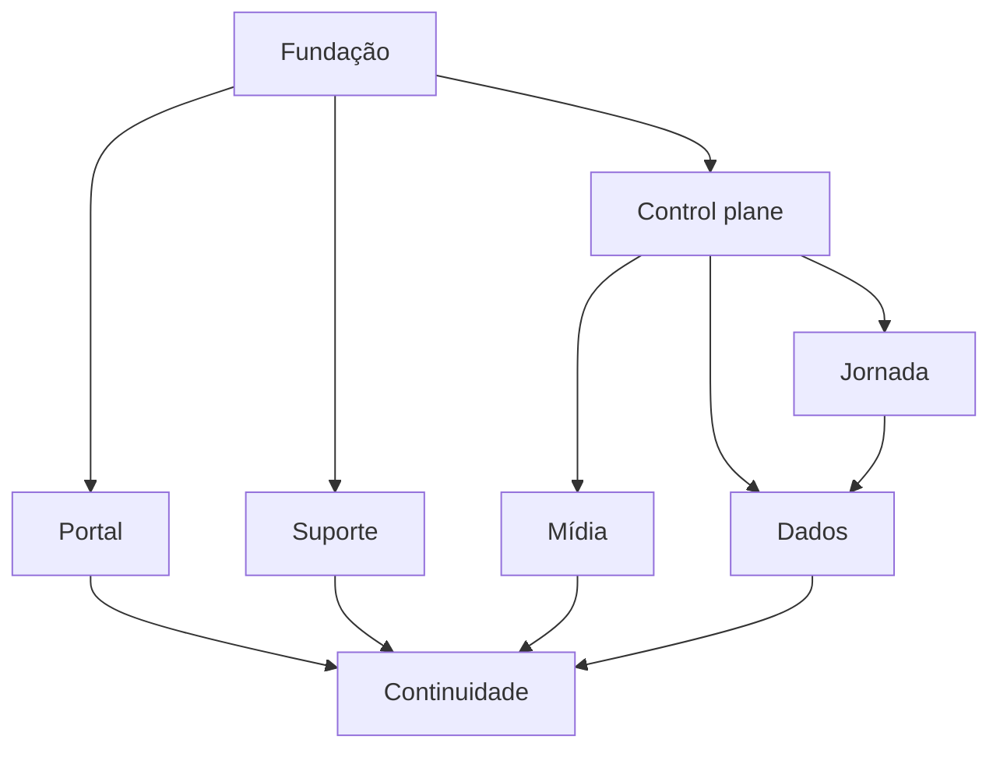

# Roadmap da plataforma permanente

Este roadmap organiza dependências. Não substitui issues existentes.

## Wave A — Fundação e release safety

Objetivo: tornar o que já existe reproduzível e recuperável.

Inclui:
- Issue #2 backup/restore/alertas;
- Issue #3 preflight de produção;
- Issue #20 secret scan;
- branch protection/checks;
- inventário de serviços e owners;
- observabilidade mínima;
- documentação deste programa.

Saída: plataforma pode ser operada sem improviso.

## Wave B — Control plane operacional

Objetivo: administrar programa sem editar banco/planilha manualmente.

Capacidades:
- criar/gerir instituições/programas/ofertas;
- criar turma;
- cadastrar/importar/associar participante;
- matrícula e revogação;
- equipe e papéis;
- course version lifecycle;
- dashboard operacional básico;
- trilha de auditoria.

Reutilizar entidades atuais.

## Wave C — Jornada comprovável

- Issue #6 frequência;
- Issue #5 certificado;
- Issue #7 mentoria/evidência;
- Issue #8 follow-up 30/60/90;
- ActivityAttempt contextual;
- projection journey-export;
- critérios humanos configuráveis quando aprovados.

## Wave D — Portal e comunicação

- portal público;
- notícias;
- catálogo;
- agenda;
- materiais;
- páginas de privacidade/exclusão;
- verificação de certificado;
- suporte;
- feed de notícias no app;
- analytics público separado.

## Wave E — Suporte integrado

Seguir CW-1..CW-6:
- UX local;
- identidade segura;
- competências;
- integração server-to-server;
- projeção mínima;
- staging/restore.

## Wave F — Mídia e materiais

- upload/ingestão;
- master Drive;
- R2/provider;
- metadados API;
- publicação;
- autorização;
- legendas/transcrição;
- analytics;
- política offline.

## Wave G — Dados e inteligência

- data dictionary;
- qualidade de dados;
- reconciliação baseline;
- projeção BI;
- métricas com denominador;
- observabilidade de pipeline;
- governança de acesso.

IA permanece assistiva.

## Wave H — Continuidade institucional

- contas institucionais e dois admins;
- inventário completo;
- restore multi-serviço;
- manual de passagem;
- DR drill;
- custo/renovação;
- offboarding/onboarding;
- política de retenção;
- auditoria periódica.

## Dependências principais

## Critério de prioridade

1. risco de perda de dados/segredo;
2. bloqueio de release;
3. integridade acadêmica;
4. operação manual que gera erro;
5. experiência do usuário;
6. escala/custo;
7. conveniência.

## Não fazer

- big bang;
- reescrever Flutter/API simultaneamente;
- migrar tudo para nova stack sem necessidade;
- conectar baseline sensível antes de identidade e governança;
- liberar produção para “testar”.
