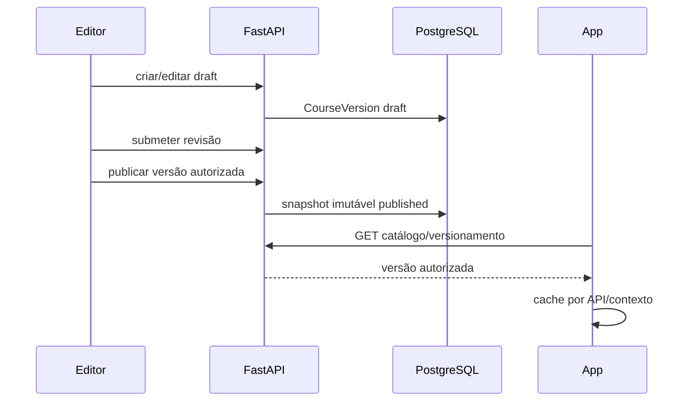
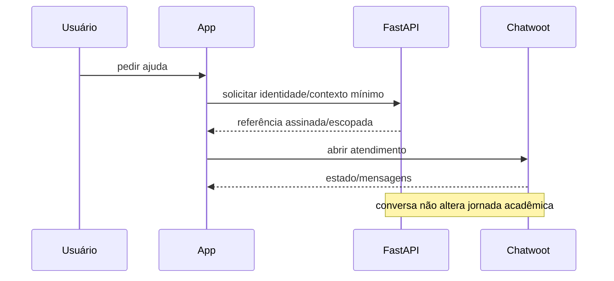
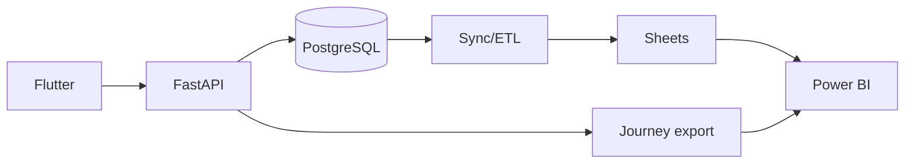

# Arquitetura alvo — Tutor TDS

## 1. Visão

A arquitetura alvo mantém o FastAPI/PostgreSQL como núcleo e organiza os demais componentes em superfícies especializadas.

Os diagramas e fluxos abaixo são TARGET, salvo evidência explicitamente indicada.
Checkpoint OBSERVED da consolidação `3fddb09`: Context Core possui aceite em
staging; catálogo tem evidência física histórica e política posterior #4 validada
localmente, sem novo aceite físico/staging inferido. CW-1 é demonstração local com fake, sem atendimento
real (`../production/CHATWOOT_CW1_IMPLEMENTATION.md`). Identidade assinada Chatwoot,
webhooks/casos proativos, mídia e administração web permanecem alvos nos recortes
não comprovados. Desde aquele checkpoint, WP-1/#49 e API pública/#50 foram
integrados na base `1a577a6`, sem novo aceite de staging inferido. Overlay/#51
permanece candidato separado e requer reconciliação com a decisão posterior de
#5. Emissão autenticada permanece fronteira #5/#39.

```mermaid
flowchart LR
  U[Participante] --> APP[Flutter Android/PWA]
  PUB[Público] --> WEB[Portal / WordPress]
  EQ[Equipe] --> APP
  EQ --> ADM[Admin Web futuro / superfícies administrativas]

  APP --> API[FastAPI Tutor TDS]
  ADM --> API
  WEB -->|somente leitura pública| API

  API --> DB[(PostgreSQL)]
  API --> GW[Cloudflare Gateway]
  GW --> RAG[AnythingLLM / modelos]
  GW --> KV[(KV certificados)]

  APP --> CW[Chatwoot]
  API <-->|identidade/contexto mínimo| CW

  API --> SYNC[Sync Worker]
  SYNC --> SHEETS[Google Sheets]
  SHEETS --> BI[Power BI]

  API --> MEDIA[Provider de mídia]
  MEDIA --> R2[(R2 / object storage)]
  DRIVE[Google Drive master] --> MEDIA

  WPDB[(Banco WordPress)] --> WEB
  BAK[Backup offsite] <-- DB
  BAK <-- WPDB
```

## 2. Camadas

### 2.1 Experiência
- Flutter: experiência autenticada, offline, estudo, turma, suporte, evidência.
- Portal público: programa, notícias, catálogo público, materiais públicos, links oficiais, FAQ, privacidade e verificação.
- Admin web: apenas quando existir necessidade operacional que não caiba no app. Deve consumir a mesma API, não criar backend paralelo.

### 2.2 Domínio
FastAPI é a fronteira de autorização. O domínio alvo abrange os itens abaixo;
estar nesta lista não comprova implementação ou integração completa:
- identidade;
- organização/instituição/programa;
- curso e versão;
- oferta/turma;
- membership/enrollment;
- atividades e progresso;
- presença quando formalizada;
- certificados;
- mentoria/evidências;
- referências mínimas de suporte;
- mídia e publicação.

### 2.3 Persistência
- PostgreSQL: dados transacionais e auditoria.
- SQLite/app storage: cache/outbox local, nunca autoridade após sincronização.
- WordPress DB: conteúdo público/editorial apenas.
- KV: certificado/verificação conforme contrato existente.
- R2/Drive: blobs, masters, backup e anexos conforme política.

## 3. Limites de serviço

### FastAPI
Pode decidir autorização. Não deve servir vídeo master nem virar CMS de notícias.

### Flutter
Pode coletar intenção, exibir estado e manter outbox. Não pode possuir segredo servidor, aprovar matrícula ou inventar resultado offline.

### WordPress
Pode editar notícia, página, agenda e conteúdo público. Não pode receber CPF, senha, baseline, matrícula ou frequência.

### Chatwoot
Pode gerir conversa e fila. Não pode ser usado como banco acadêmico.

### Sheets/BI
Podem agregar/projetar. Correção de dado mestre volta à origem; não editar projeção para “consertar” PostgreSQL.

### Gateway/IA
Pode responder, resumir ou gerar material sob política. Não concede permissão, nota, presença, certificado ou elegibilidade.

## 4. Contexto canônico

Toda operação acadêmica sensível deve resolver, quando aplicável:

```text
environment
institution_id
program_id
course_id
course_version_id
class_id/cohort_id
membership_id
enrollment_id
user_id
actor_user_id
request_id/idempotency_key
```

Não usar nome, telefone ou CPF como chave de relacionamento entre sistemas.

## 5. Fluxo de publicação pedagógica



Turma fixada em uma edição não muda silenciosamente quando uma nova versão é publicada.

## 6. Fluxo de suporte



## 7. Fluxo analítico



Pseudonimizar onde possível. BI não deve receber transcrição de chat ou baseline integral sem finalidade aprovada.

## 8. Fluxo de mídia

Master → revisão → metadados na API → processamento/entrega por provider → autorização curta → playback.

O app recebe `media_id`, metadados e grant de reprodução, não credenciais do provider.

## 9. Ambientes

### Local
Dados sintéticos, serviços simulados, nenhuma credencial real obrigatória.

### Staging
Dados sintéticos ou explicitamente autorizados, contas próprias, storage próprio e flags separadas. Pode validar integração.

### Produção
Somente artefato versionado, config validada, secrets em gerenciador autorizado, migrations testadas e gate humano.

Nunca compartilhar banco, bucket, inbox, planilha ou secrets entre staging e produção por conveniência.

## 10. Requisitos transversais

- TLS em todas as interfaces públicas.
- autenticação e RBAC server-side;
- idempotência em comandos repetíveis;
- auditoria de transições sensíveis;
- timestamps UTC no backend e exibição local;
- paginação e limites;
- rate limiting onde exposto;
- correlation/request ID;
- logs sem secrets/CPF;
- health, readiness e version;
- feature flags para migrações de alto risco;
- migração aditiva com rollback/forward recovery;
- política de retenção por tipo de dado;
- acessibilidade no Flutter/portal;
- contratos testados com cenário negativo.

## 11. Anti-arquiteturas proibidas

- novo Firebase/Firestore paralelo para entidades já existentes;
- WordPress como “banco de aluno”;
- planilha como autorização;
- URL de Drive fixa embarcada como CDN;
- vídeo servido diretamente pela VPS em escala;
- lógica de frequência baseada em page_view;
- certificado gerado apenas no cliente;
- vínculo automático por nome/telefone;
- segredo em Dart, JS do portal ou repositório;
- ambiente “staging” apontando para banco de produção.
